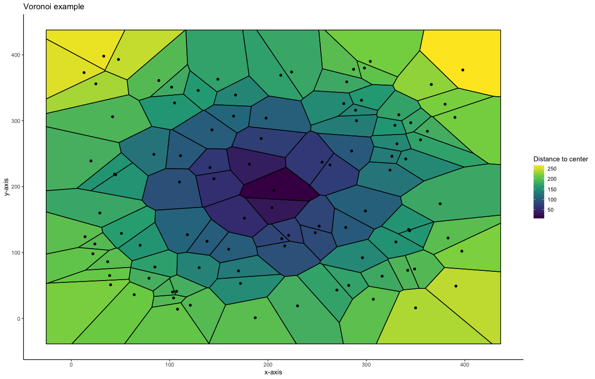

# GLX_Portofolio
{:.no_toc}

My data science portfolio

* TOC 
{:toc}

# [Project 1: Energy Consumption Analysis](https://github.com/glxdata/energy_project)

> Plotting energy and gas consumption for a typical household to examine seasonal and temporal trends
> 
> Including ANOVA analysis and data wrangeling for dates

# [Project 2: Voronoi Graphs](https://github.com/glxdata/voronoi)

> Example plotting Voronoi graphs in R
> 
> Including colorblind friendly style

